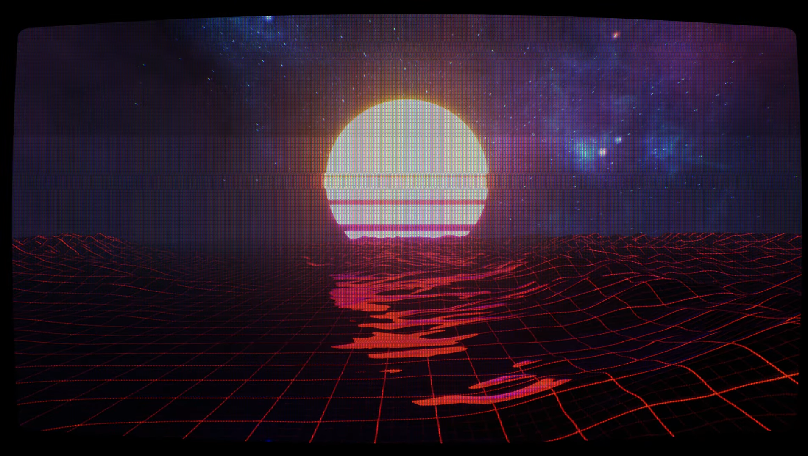

# Synthwave Visualizer
This is a music visualizer I made in 2020 for an original synthwave song entitled Ahjah Nobru. The visualizer was made using Unreal Engine 4 and leverages unreal's Sound Visualization framework to gather audio data. Audio data is used in order to make certain custom materials respond dynamically to the song. There were additional custom post processing shaders used to create a retro CRT feel to enhance the synthwave aesthetic. Click [here](https://youtu.be/0oRiXRuIIfg) to see the final product.



## Code
## Music Controller
The music controller is responsible for playing the song and storing audio specrum data.

### Music Controller.h
```C++
#pragma once

#include "CoreMinimal.h"
#include "GameFramework/Actor.h"
#include "Sound/SoundWave.h"
#include "MusicController.generated.h"

class UAudioComponent;

DECLARE_DYNAMIC_MULTICAST_DELEGATE(FMusicControllerEvent);

USTRUCT(BlueprintType)
struct FTrackData
{
	GENERATED_BODY()

public:
	UPROPERTY(EditAnywhere, BlueprintReadWrite, Category = "Synth Visualization Track Properties")
	FName trackID;
	UPROPERTY(EditAnywhere, BlueprintReadWrite, Category = "Synth Visualization Track Properties")
	USoundWave* track;
	UPROPERTY(EditAnywhere, Category = "Synth Visualization Track Properties")
	int32 spectrumResolution;
	UPROPERTY(EditAnywhere, Category = "Synth Visualization Track Properties")
	float spectrumTimeSlice;
	UPROPERTY(EditAnywhere, Category = "Synth Visualization Track Properties")
	float spectrumClamp;
	UPROPERTY(EditAnywhere, Category = "Synth Visualization Track Properties")
	float spectrumPowerFactor;
	UPROPERTY(EditAnywhere, Category = "Synth Visualization Track Properties Debug")
	FColor trackColour;

	UPROPERTY(VisibleInstanceOnly, Category = "Synth Visualization Track Properties")
	bool isArmed;
	UPROPERTY(VisibleInstanceOnly, Category = "Synth Visualization Track Properties")
	float minFrequency;
	UPROPERTY(VisibleInstanceOnly, Category = "Synth Visualization Track Properties")
	float maxFrequency;
	UPROPERTY(VisibleInstanceOnly, Category = "Synth Visualization Track Properties")
	TArray<float> spectrum;
	UPROPERTY(VisibleInstanceOnly, Category = "Synth Visualization Track Properties")
	USoundWave* trackInstance;

	FTrackData();
	bool operator== (FTrackData data)
	{
		return (this->trackID == data.trackID);
	}

	FORCEINLINE explicit operator bool() const
	{
		return isArmed;
	}

	void ArmTrack(AMusicController* musicController, USoundWave* masterTrack = nullptr);
	void UpdateSpectrum(AMusicController* musicController);
	float EvaluateRawFrequency(float frequencyNormalized);
	float EvaluateClampedFrequency(float frequencyNormalized);
	float EvaluateNormalizedFrequency(float frequencyNormalized);
};

USTRUCT(BlueprintType)
struct FSong
{
	GENERATED_BODY()

public:

	UPROPERTY()
	FTrackData masterTrack;
	UPROPERTY()
	TArray<FTrackData> detailTracks;

	FSong()
	{
		masterTrack = FTrackData();
		detailTracks = TArray<FTrackData>();
	}
};

UCLASS(BlueprintType, Blueprintable)
class SYNTHVISUALIZER_API AMusicController : public AActor
{
	GENERATED_BODY()
	
public:	
	// Sets default values for this actor's properties
	AMusicController();

	// Music Controller Public API
	UPROPERTY(BlueprintAssignable)
	FMusicControllerEvent OnTrackStart;
	UPROPERTY(BlueprintAssignable)
	FMusicControllerEvent OnTrackEnd;
	UPROPERTY(BlueprintAssignable)
	FMusicControllerEvent OnTrackPaused;

	// Music Controller Blueprint
	UFUNCTION(BlueprintCallable, Category = "Synth Visualization Music Controller")
	void ArmTrackTest(FSong trackData);
	UFUNCTION(BlueprintCallable, Category = "Synth Visualization Music Controller")
	void PlayTrack(float startPercent = 0.0f, float fadeInDuration = 0.0f);
	UFUNCTION(BlueprintCallable, Category = "Synth Visualization Music Controller")
	void PauseTrack();
	UFUNCTION(BlueprintCallable, Category = "Synth Visualization Music Controller")
	void ResumeTrack();
	UFUNCTION(BlueprintCallable, Category = "Synth Visualization Music Controller")
	void StopTrack();
	UFUNCTION(BlueprintCallable, Category = "Synth Visualization Music Controller")
	void ResetTrack();
	UFUNCTION(BlueprintCallable, Category = "Synth Visualization Music Controller")
	float EvaluateNormalizedSpectrum(float normalizedFrequency, FName trackID);
	UFUNCTION(BlueprintCallable, Category = "Synth Visualization Music Controller")
	float GetCurrentSongTime();
	UFUNCTION(BlueprintCallable, Category = "Synth Visualization Music Controller")
	float GetCurrentSongPercent();
	UFUNCTION(BlueprintCallable, Category = "Synth Visualization Music Controller")
	float GetCurrentSongDuration();
	UFUNCTION(Blueprintcallable, Category = "Synth Visualization Music Controller")
	FString GetCurrentTrackTimeText();
	UFUNCTION(BlueprintImplementableEvent)
	TArray<float> CalculateFrequencySpectrum(USoundWave* track, float startTime, float timeLength, int32 spectrumResolution); // Currently have to do this in BP >:( because can't access SoundVisualizations library from c++ >:(    >:(    >:( 

	// Actor
	virtual void Tick(float DeltaTime) override;
	virtual void BeginDestroy() override;

protected:
	// Called when the game starts or when spawned
	virtual void BeginPlay() override;

private:
	void Initialize();
	void ArmTrack();
	void DisarmTrack();
	void UpdateTrackState(float DeltaTime);
	void UpdateFrequencySpectrums();

	UFUNCTION()
	void UpdatePlaybackPercent(const USoundWave* playingSoundWave, const float playbackPercent);
	UFUNCTION()
	void OnAudioFinished();

	// Utils
	USoundWave* GetTrack(FName trackID);
	FTrackData* GetTrackData(FName trackID);

	// Debugging
	void DoDebugLogic();

public:
	UPROPERTY(EditDefaultsOnly, BlueprintReadWrite, Category = "Music Controller")
	UAudioComponent* AudioComponent;
	UPROPERTY(EditAnywhere, BlueprintReadWrite, Category = "Music Controller")
	FTrackData MasterTrack;
	UPROPERTY(EditAnywhere, BlueprintReadWrite, Category = "Music Controller")
	TArray<FTrackData> detailTracks;
	UPROPERTY(EditAnywhere, BlueprintReadWrite, Category = "Music Controller")
	bool PlayOnStart;
	UPROPERTY(EditAnywhere, BlueprintReadWrite, Category = "Music Controller", meta = (EditCondition="PlayOnStart", ClampMin = "0", ClampMax = "1"))
	float SongStartPercent;

	UPROPERTY(EditAnywhere, Category = "Music Controller Debugging")
	bool enableDebugging = false;
	UPROPERTY(EditAnywhere, Category = "Music Controller Debugging")
	float debugLineSegmentDistance = 200.0f;
	UPROPERTY(EditAnywhere, Category = "Music Controller Debugging")
	float debugLineSeperationDistance = 100.0f;
	UPROPERTY(EditAnywhere, Category = "Music Controller Debugging")
	float debugLineThickness = 50.0f;
	UPROPERTY(EditAnywhere, Category = "Music Controller Debugging")
	float debugFrequencyHeightScale;
	UPROPERTY(EditAnywhere, Category = "Music Controller Debugging", meta = (ClampMin="0", ClampMax="1"))
	float debugSpectrumPosition;

private:
	bool isArmed;
	bool isPlayingTrack;
	float songPercent;
	float songTime;
	float songDuration;
	float initialAudioTime;
	float initialPlaybackPercent;
	TMap<FName, FTrackData*> trackMap;
};
```

### MusicController.cpp
```C++
#include "MusicController.h"
#include "Components/AudioComponent.h"
#include "Runtime/Engine/Classes/Kismet/GameplayStatics.h"
#include "HAL/MemoryBase.h"
#include "DrawDebugHelpers.h"

FTrackData::FTrackData()
{
	trackID = FName("TrackID");
	track = nullptr;
	spectrumResolution = 64;
	spectrumTimeSlice = 0.1f;
	spectrumClamp = 60.0f;
	spectrumPowerFactor = 2.0f;
	isArmed = false;
	minFrequency = spectrumClamp;
	maxFrequency = -spectrumClamp;
	spectrum = TArray<float>();
	trackInstance = nullptr;
	trackColour = FColor::White;
	for (int i = 0; i < spectrumResolution; i++) spectrum.Add(-spectrumClamp);
}

void FTrackData::ArmTrack(AMusicController* musicController, USoundWave* masterTrack)
{
	isArmed = false;
	if (track == nullptr || !track->IsValidLowLevel()) return;

	trackInstance = track;
	spectrum.Empty();
	for (int i = 0; i < spectrumResolution; i++) spectrum.Add(-spectrumClamp);
	isArmed = true;

	if (masterTrack != nullptr)
	{
		if (trackInstance->GetDuration() != masterTrack->GetDuration())
		{
			UE_LOG(LogTemp, Warning, TEXT("(%s): Detail track (%s) duration (%f) does not match master track duration (%f)."), *(musicController->GetName()), *(trackID.ToString()), trackInstance->GetDuration(), masterTrack->GetDuration());
		}
	}
}

void FTrackData::UpdateSpectrum(AMusicController* musicController)
{
	if (!isArmed) return;

	spectrum = musicController->CalculateFrequencySpectrum(trackInstance, musicController->GetCurrentSongTime(), spectrumTimeSlice, spectrumResolution);

	for (int i = 0; i < spectrum.Num(); i++)
	{
		float frequency = FMath::Clamp(spectrum[i], -spectrumClamp, spectrumClamp);
		if (frequency > maxFrequency)
		{
			maxFrequency = frequency;
		}

		if (frequency < minFrequency)
		{
			minFrequency = frequency;
		}
	}
}

float FTrackData::EvaluateRawFrequency(float frequencyNormalized)
{
	if (!isArmed) return -spectrumClamp;

	float freqNorm = FMath::Clamp(frequencyNormalized, 0.0f, 1.0f);
	float freq = freqNorm * (spectrumResolution - 1);
	int freqIndx = FMath::RoundToInt(freq);
	return spectrum[freqIndx];
}

float FTrackData::EvaluateClampedFrequency(float frequencyRange)
{
	if (!isArmed) return 0.0f;

	return FMath::Clamp(EvaluateRawFrequency(frequencyRange), -spectrumClamp, spectrumClamp);
}

float FTrackData::EvaluateNormalizedFrequency(float frequencyRange)
{
	if (!isArmed) return 0.0f;

	float clampedFrequency = EvaluateClampedFrequency(frequencyRange);
	float normalizedFrequency = (clampedFrequency + spectrumClamp) / (2 * spectrumClamp);
	float powerFrequency = FMath::Pow(normalizedFrequency, spectrumPowerFactor);
	return powerFrequency;
}

// Sets default values
AMusicController::AMusicController()
{
	isArmed = false;
	isPlayingTrack = false;
	songPercent = 0.0f;
	songDuration = 0.0f;
	trackMap = TMap<FName, FTrackData*>();
	PrimaryActorTick.bCanEverTick = true;
	AudioComponent = CreateDefaultSubobject<UAudioComponent>(FName("Audio Player"));
}

void AMusicController::ArmTrackTest(FSong trackData)
{

}

void AMusicController::PlayTrack(float startPercent, float fadeInDuration)
{
	if (!isArmed)
	{
		UE_LOG(LogTemp, Warning, TEXT("(%s): Trying to play a song but not armed!"), *GetName());
		return;
	}

	if (isPlayingTrack)
	{
		ResetTrack();
		return;
	}

	isPlayingTrack = true;
	songPercent = startPercent;
	songTime = songPercent * songDuration;
	initialAudioTime = UGameplayStatics::GetAudioTimeSeconds(GetWorld()) - songTime;
	initialPlaybackPercent = songPercent;

	AudioComponent->Sound = Cast<USoundBase>(MasterTrack.trackInstance);
	AudioComponent->FadeIn(fadeInDuration, 1.0f, songTime, EAudioFaderCurve::Linear);
	OnTrackStart.Broadcast();
	UE_LOG(LogTemp, Log, TEXT("(%s): Playing track..."), *GetName());
}

void AMusicController::PauseTrack()
{
	isPlayingTrack = false;
	AudioComponent->SetPaused(true);
	OnTrackPaused.Broadcast();
}

void AMusicController::ResumeTrack()
{
	if (!isArmed) return;

	isPlayingTrack = true;
	AudioComponent->SetPaused(false);
}

void AMusicController::StopTrack()
{
	isPlayingTrack = false;
	songTime = 0.0f;
	songPercent = 0.0f;
	AudioComponent->Stop();
	OnTrackEnd.Broadcast();
	UE_LOG(LogTemp, Log, TEXT("(%s): Track finished."), *GetName());
}

void AMusicController::ResetTrack()
{
	isPlayingTrack = false;
}

float AMusicController::EvaluateNormalizedSpectrum(float normalizedFrequency, FName trackID)
{
	if (!trackMap.Contains(trackID))
	{
		return 0.0f;
	}
	else
	{
		FTrackData* track = trackMap[trackID];
		return track->EvaluateNormalizedFrequency(normalizedFrequency);
	}
}

float AMusicController::GetCurrentSongTime()
{
	return songTime;
}

float AMusicController::GetCurrentSongPercent()
{
	return songPercent;
}

float AMusicController::GetCurrentSongDuration()
{
	return songDuration;
}

FString AMusicController::GetCurrentTrackTimeText()
{
	float processedTrackTime = songPercent * songDuration;
	int trackMinutes = FMath::FloorToInt(processedTrackTime / 60.0f);
	processedTrackTime = fmod(processedTrackTime, 60.0f);
	int trackSeconds = FMath::FloorToInt(processedTrackTime);
	processedTrackTime = fmod(processedTrackTime, 1.0f);
	int trackDeci = FMath::FloorToInt(processedTrackTime * 100.0f);
	return FString::Printf(TEXT("%02d : %02d : %02d"), trackMinutes, trackSeconds, trackDeci);
}

void AMusicController::BeginPlay()
{
	Super::BeginPlay();
	Initialize();
	if (isArmed && PlayOnStart) PlayTrack(SongStartPercent);
}

void AMusicController::Tick(float DeltaTime)
{
	Super::Tick(DeltaTime);
	UpdateTrackState(DeltaTime);
	if (enableDebugging) DoDebugLogic();
}


void AMusicController::BeginDestroy()
{
	if (IsRooted()) RemoveFromRoot();
	Super::BeginDestroy();
}

void AMusicController::Initialize()
{
	AudioComponent->OnAudioPlaybackPercent.AddDynamic(this, &AMusicController::UpdatePlaybackPercent);
	AudioComponent->OnAudioFinished.AddDynamic(this, &AMusicController::OnAudioFinished);
	ArmTrack();
}

void AMusicController::ArmTrack()
{
	if (isArmed) DisarmTrack();

	MasterTrack.ArmTrack(this);
	if (!MasterTrack.isArmed)
	{
		UE_LOG(LogTemp, Warning, TEXT("(%s): Failed to arm track. Couldn't arm master track."), *GetName());
		return;
	}

	songDuration = MasterTrack.trackInstance->GetDuration();
	trackMap.Add(TTuple<FName, FTrackData*>(MasterTrack.trackID, &MasterTrack));
	UE_LOG(LogTemp, Log, TEXT("(%s): Master track (%s) armed."), *GetName(), *(MasterTrack.trackID.ToString()));

	TArray<FTrackData> tracksToRemove = TArray<FTrackData>();
	for (int i = 0; i < detailTracks.Num(); i++)
	{
		if (trackMap.Contains(detailTracks[i].trackID))
		{
			UE_LOG(LogTemp, Warning, TEXT("(%s): Trying to arm track with duplicate track ID (%s)"), *GetName(), *(detailTracks[i].trackID.ToString()));
			tracksToRemove.Add(detailTracks[i]);
			continue;
		}

		detailTracks[i].ArmTrack(this, MasterTrack.trackInstance);
		if (!detailTracks[i].isArmed)
		{
			tracksToRemove.Add(detailTracks[i]);
			continue;
		}

		trackMap.Add(detailTracks[i].trackID, &detailTracks[i]);
		UE_LOG(LogTemp, Warning, TEXT("(%s): Armed detail track (%s)"), *GetName(), *(detailTracks[i].trackID.ToString()));
	}

	for (int i = 0; i < tracksToRemove.Num(); i++)
	{
		detailTracks.Remove(tracksToRemove[i]);
	}

	isArmed = true;
	UE_LOG(LogTemp, Log, TEXT("(%s): Track armed."), *GetName());
}

void AMusicController::DisarmTrack()
{
	if (!isArmed) return;
	trackMap.Empty();
	isArmed = false;
}

void AMusicController::UpdateTrackState(float DeltaTime)
{
	if (isPlayingTrack)
	{
		UpdateFrequencySpectrums();
	}
}

void AMusicController::UpdateFrequencySpectrums()
{
	if (MasterTrack.isArmed) MasterTrack.UpdateSpectrum(this);

	for (int i = 0; i < detailTracks.Num(); i++)
	{
		if (!detailTracks[i].isArmed) continue;
		detailTracks[i].UpdateSpectrum(this);
	}
}

void AMusicController::UpdatePlaybackPercent(const USoundWave* playingSoundWave, const float playbackPercent)
{
	songPercent = initialPlaybackPercent + playbackPercent;
	songTime = songPercent * songDuration;
}

void AMusicController::OnAudioFinished()
{
	StopTrack();
}

USoundWave* AMusicController::GetTrack(FName trackID)
{
	FTrackData* trackData = GetTrackData(trackID);
	if (trackData != nullptr)
	{
		return trackData->trackInstance;
	}
	else
	{
		return nullptr;
	}
}

FTrackData* AMusicController::GetTrackData(FName trackID)
{
	FTrackData** trackData = trackMap.Find(trackID);
	if (trackData == nullptr || *trackData == nullptr || !(*trackData)->isArmed)
	{
		return nullptr;
	}
	else
	{
		return *trackData;
	}
}

void AMusicController::DoDebugLogic()
{
	if (!isArmed || !isPlayingTrack) return;

	FVector startPos = GetActorLocation();
	for (int i = 1; i < MasterTrack.spectrumResolution; i++)
	{
		float freq1Indx = (i - 1.0f) / (float)MasterTrack.spectrumResolution;
		float freq1 = MasterTrack.EvaluateNormalizedFrequency(freq1Indx) * debugFrequencyHeightScale;
		float freq2Indx = (float)i / (float)MasterTrack.spectrumResolution;
		float freq2 = MasterTrack.EvaluateNormalizedFrequency(freq2Indx) * debugFrequencyHeightScale;

		FVector pos1 = startPos + (FVector::ForwardVector * debugLineSegmentDistance * (i - 1) + (FVector::UpVector * freq1));
		FVector pos2 = startPos + (FVector::ForwardVector * debugLineSegmentDistance * (i)) + (FVector::UpVector * freq2);;
		DrawDebugLine(GetWorld(), pos1, pos2, MasterTrack.trackColour, false, 0.0f, 1.0f, debugLineThickness);

		if (FMath::Abs(freq1Indx - debugSpectrumPosition) <= (0.5f / MasterTrack.spectrumResolution))
		{
			DrawDebugLine(GetWorld(), pos1, startPos + (FVector::ForwardVector* debugLineSegmentDistance * (i-1)), MasterTrack.trackColour, false, 0.0f, 1.0f, debugLineThickness);
		}
	}

	for (int i = 0; i < detailTracks.Num(); i++)
	{
		if (!detailTracks[i].isArmed) continue;
		for (int j = 1; j < MasterTrack.spectrumResolution; j++)
		{
			float freq1Indx = (j - 1.0f) / (float)detailTracks[i].spectrumResolution;
			float freq1 = detailTracks[i].EvaluateNormalizedFrequency(freq1Indx) * debugFrequencyHeightScale;
			float freq2Indx = (float)j / (float)detailTracks[i].spectrumResolution;
			float freq2 = detailTracks[i].EvaluateNormalizedFrequency(freq2Indx) * debugFrequencyHeightScale;

			FVector pos1 = startPos + (FVector::RightVector * debugLineSeperationDistance * (i + 1)) + (FVector::ForwardVector * debugLineSegmentDistance * (j - 1) + (FVector::UpVector * freq1));
			FVector pos2 = startPos + (FVector::RightVector * debugLineSeperationDistance * (i + 1)) + (FVector::ForwardVector * debugLineSegmentDistance * (j)) + (FVector::UpVector * freq2);;
			DrawDebugLine(GetWorld(), pos1, pos2, detailTracks[i].trackColour, false, 0.0f, 1.0f, debugLineThickness);

			if (FMath::Abs(freq1Indx - debugSpectrumPosition) <= (0.5f / detailTracks[i].spectrumResolution))
			{
				DrawDebugLine(GetWorld(), pos1, startPos + (FVector::RightVector * debugLineSeperationDistance * (i + 1)) + (FVector::ForwardVector* debugLineSegmentDistance * (j - 1)), detailTracks[i].trackColour, false, 0.0f, 1.0f, debugLineThickness);
			}
		}
	}

	DrawDebugLine(GetWorld(), startPos, startPos + (debugLineSegmentDistance * MasterTrack.spectrumResolution * FVector::ForwardVector), FColor::Black, false, 0.0f, 1.0f, debugLineThickness);
	DrawDebugLine(GetWorld(), startPos + (FVector::UpVector * debugFrequencyHeightScale), startPos + (debugLineSegmentDistance * MasterTrack.spectrumResolution * FVector::ForwardVector) + (FVector::UpVector * debugFrequencyHeightScale), FColor::Black, false, 0.0f, 1.0f, debugLineThickness);
}
```

## Music Responder
The music responder class is the base class for all objects which respond to the audio spectrum data.
### MusicResponder.h
```C++
#pragma once

#include "CoreMinimal.h"
#include "GameFramework/Actor.h"
#include "MusicResponder.generated.h"

class AMusicController;

USTRUCT(BlueprintType)
struct FTrackResponse
{
	GENERATED_BODY()

public:
	UPROPERTY(EditAnywhere, Category = "Music Response")
	FName trackName;
	UPROPERTY(EditAnywhere, Category = "Music Response", meta = (ClampMin="0", ClampMax="1"))
	float frequencyTune;

	FTrackResponse()
	{
		trackName = FName("None");
		frequencyTune = 0.0f;
	}
};

UCLASS(BlueprintType, Blueprintable)
class SYNTHVISUALIZER_API AMusicResponder : public AActor
{
	GENERATED_BODY()
	
public:	
	// Sets default values for this actor's properties
	AMusicResponder();


protected:
	// Called when the game starts or when spawned
	virtual void BeginPlay() override;

	// Music Responder Interface
	UFUNCTION()
	virtual void InitializeMusicResponder() {};
	UFUNCTION()
	virtual void OnTrackStart() {};
	UFUNCTION()
	virtual void OnTrackEnd() {};

public:

protected:
	UPROPERTY(BlueprintReadWrite, Category = "Music Responder")
	AMusicController* musicController;
};
```

### MusicResponder.cpp
```C++
#include "MusicResponder.h"
#include "Runtime/Engine/Classes/Kismet/GameplayStatics.h"
#include "SynthVisualizer/MusicController/MusicController.h"

// Sets default values
AMusicResponder::AMusicResponder()
{
 	// Set this actor to call Tick() every frame.  You can turn this off to improve performance if you don't need it.
	PrimaryActorTick.bCanEverTick = true;

}

// Called when the game starts or when spawned
void AMusicResponder::BeginPlay()
{
	Super::BeginPlay();
	TArray<AActor*> musicControllers;
	UGameplayStatics::GetAllActorsOfClass(this, AMusicController::StaticClass(), musicControllers);

	if (musicControllers.Num() < 0)
	{
		UE_LOG(LogTemp, Warning, TEXT("Music Responder (%s): Failed to initializer. Couldn't find music controller."), *GetName());
		SetActorTickEnabled(false);
	}

	musicController = Cast<AMusicController>(musicControllers[0]);
	if (musicController == nullptr)
	{
		UE_LOG(LogTemp, Warning, TEXT("Music Responder (%s): Failed to initializer. Failed to cast music controller?"), *GetName());
		SetActorTickEnabled(false);
	}

	musicController->OnTrackStart.AddDynamic(this, &AMusicResponder::OnTrackStart);
	musicController->OnTrackEnd.AddDynamic(this, &AMusicResponder::OnTrackEnd);

	InitializeMusicResponder();
	UE_LOG(LogTemp, Log, TEXT("Music Responder (%s): Initialized."), *GetName());
}
```
## Synth Sun
The synth sun class controls the prominent synth-styled sun we see in the centre of the image. This is an example of a music responder.

### SynthSun.h
```C++
#pragma once

#include "CoreMinimal.h"
#include "SynthVisualizer/MusicResponder/MusicResponder.h"
#include "SynthSun.generated.h"

class UMaterialInstanceDynamic;
class UStaticMeshComponent;

UCLASS(BlueprintType, Blueprintable)
class SYNTHVISUALIZER_API ASynthSun : public AMusicResponder
{
	GENERATED_BODY()

public:
	ASynthSun();

	// Music Responder
	virtual void InitializeMusicResponder() override;
	
	// Actor
	virtual void Tick(float DeltaTime) override;

	// Synth Sun
	UFUNCTION(BlueprintCallable, Category = "Synth Sun")
	void SetBandPanningEnabled(bool panningEnabled);

private:

protected:
	UPROPERTY(BlueprintReadWrite, EditAnywhere, Category = "Synth Sun", meta = (ClampMin = "0.1", ClampMax = "1000"))
	float maxScale = 0.5f;
	UPROPERTY(BlueprintReadWrite, EditAnywhere, Category = "Synth Sun")
	FTrackResponse ScaleResponse;
	UPROPERTY(BlueprintReadWrite, EditAnywhere, Category = "Synth Sun")
	FTrackResponse BrightnessResponse;

	UPROPERTY(EditDefaultsOnly, Category = "Synth Sun")
	UStaticMeshComponent* sunMesh;
	UPROPERTY(EditAnywhere, Category = "Synth Sun")
	TSubclassOf<UMaterialInstanceDynamic> terrainMaterial;

	UPROPERTY()
	UMaterialInstanceDynamic* dynamicMaterial;
	UPROPERTY()
	float initialScale; 
};
```

### SynthSun.cpp
```C++
#include "SynthSun.h"
#include "Materials/MaterialInstanceDynamic.h"
#include "Components/StaticMeshComponent.h"
#include "SynthVisualizer/MusicController/MusicController.h"
#include "Runtime/Engine/Classes/Kismet/GameplayStatics.h"

ASynthSun::ASynthSun()
{
	sunMesh = CreateDefaultSubobject<UStaticMeshComponent>(FName("Sun Mesh"));
	if (sunMesh == nullptr)
	{
		UE_LOG(LogTemp, Error, TEXT("(%s): Failed to initialize. Missing terrain mesh."), *GetName());
		SetActorTickEnabled(false);
	}
}

void ASynthSun::SetBandPanningEnabled(bool panningEnabled)
{
	if (dynamicMaterial == nullptr || !dynamicMaterial->IsValidLowLevel()) return;

	dynamicMaterial->SetScalarParameterValue(FName("PanFactor"), panningEnabled);
	dynamicMaterial->SetScalarParameterValue(FName("PanTimeOffset"), UGameplayStatics::GetTimeSeconds(GetWorld()));
}


void ASynthSun::InitializeMusicResponder()
{
	dynamicMaterial = sunMesh->CreateDynamicMaterialInstance(0, sunMesh->GetMaterial(0));
	initialScale = GetActorScale().X;
}

void ASynthSun::Tick(float DeltaTime)
{
	float scaleSignal = musicController->EvaluateNormalizedSpectrum(ScaleResponse.frequencyTune, ScaleResponse.trackName);
	float scale = FMath::Lerp(initialScale, initialScale * maxScale, scaleSignal);
	SetActorScale3D(FVector(scale, scale, scale));

	float brightnessSignal = musicController->EvaluateNormalizedSpectrum(BrightnessResponse.frequencyTune, BrightnessResponse.trackName);
	dynamicMaterial->SetScalarParameterValue("BrightnessSignal", brightnessSignal);
}
```
